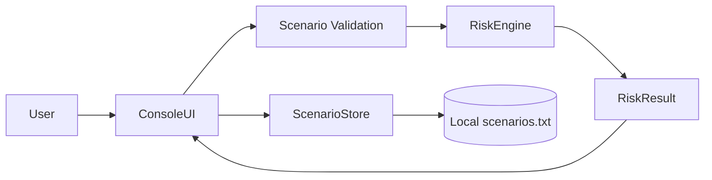
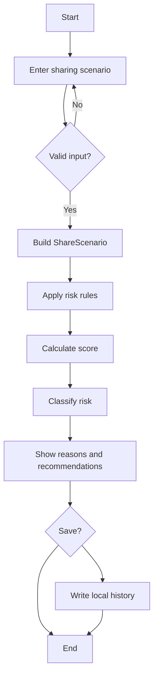
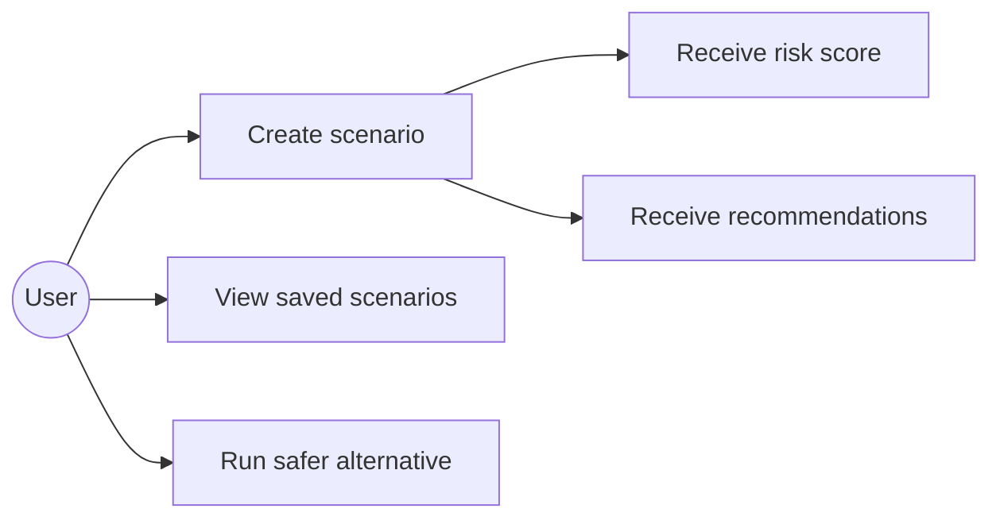
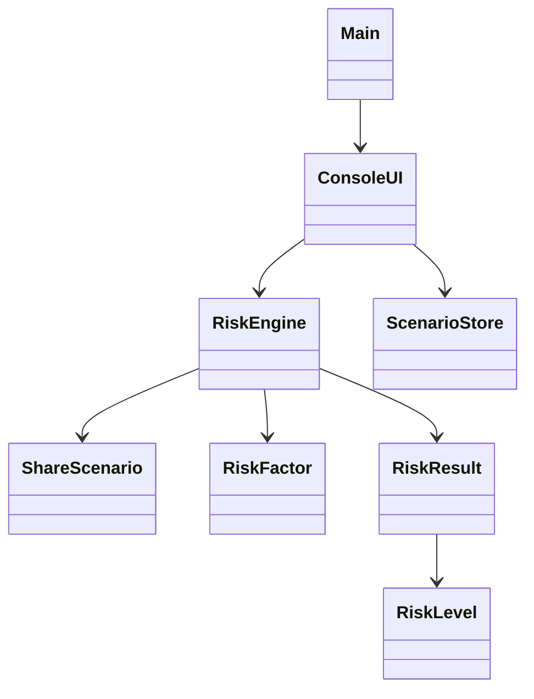
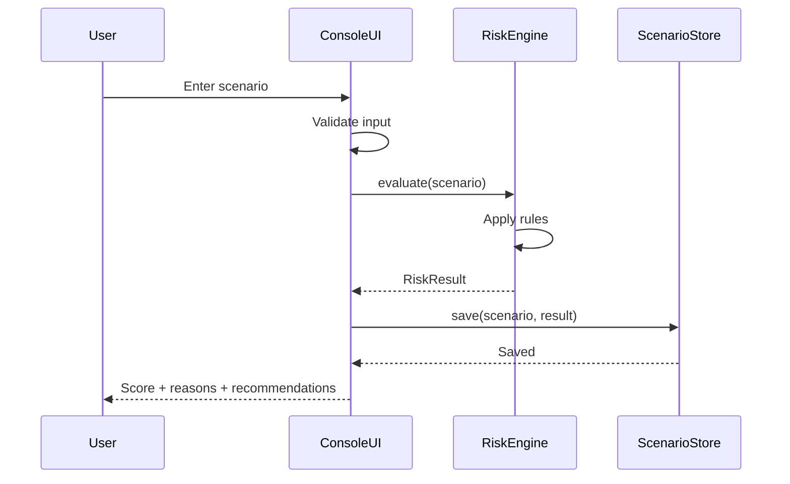

# Design Documentation

## 1. System Architecture

## 2. Workflow

## 3. Use Case Diagram

## 4. Class Diagram

## 5. Sequence Diagram

## 6. Storage Design
The project deliberately uses a small local text file rather than a database because the assignment is focused on Java programming concepts. Each saved record stores:

`scenario name | file type | risk score | risk level`

No file contents are stored.
